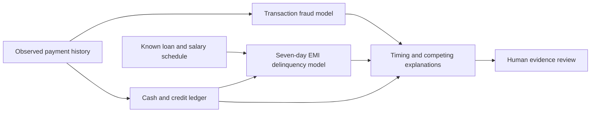

# What the trained models are doing

The system asks two separate questions: how suspicious is this observed transaction, and will the next EMI still have an unpaid balance at the end of its seventh calendar day after due? A separate evidence rule layer examines whether the observed cash shock and later pressure could be connected. It does not establish causation or the customer's role.

## Data and training

A seeded Python simulation creates the rows locally; an AI does not compose each payment. The fitting source contains 2,000 customers and 43,630 completed transactions across 60 history days, followed by 26,446 completed follow-up transactions and 1,800 pending instructions. Eight tables reconcile in integer paise. Future follow-up supplies labels, not prediction inputs. Customer cohorts and final outcomes are excluded from inputs.

Customers are split 1,400 / 300 / 300 into training, validation and test. All records belonging to one customer stay together. Two histogram gradient-boosted classifiers learn from numerical transaction or loan-snapshot features. This is the same broad boosted-tree family as XGBoost; no XGBoost comparison was run. Two candidate tree sizes are compared by validation log loss against a logistic baseline. Customer-grouped cross-fitting chooses whether probability calibration helps. Thresholds are chosen on validation, then frozen at 27.5/100 for both tasks.

| Task | Training rows | Validation rows | Test rows |
|---|---:|---:|---:|
| Transaction fraud | 16,386 | 3,490 | 3,527 |
| Seven-day EMI delinquency | 5,588 | 1,184 | 1,228 |

An EMI due 27 September has a label cutoff at the end of 4 October IST. Any unpaid paise at that cutoff is positive, including partial payment. Full payment before the cutoff is negative. Snapshots without a qualifying installment, or with immature outcomes, are excluded. Four loan snapshots from one customer can share an outcome; they are not independent people.

## Measured V2.1 results

The simulation was revised because the original fraud classes were too easy to separate. Legitimate bursts now share attributes with suspicious transfers, and some scams look ordinary. The lower current metrics describe a harder task; comparison with V2.0 is not evidence of an accuracy gain or loss on a fixed real-world benchmark.

| Internal synthetic test | Fraud | Repayment |
|---|---:|---:|
| Positive labels / rows | 171 / 3,527 | 280 / 1,228 |
| Precision | 65.3% | 59.7% |
| Recall | 77.2% | 78.2% |
| PR-AUC | 0.8026 | 0.8018 |
| Logistic baseline PR-AUC | 0.6424 | 0.7298 |
| Brier probability error (lower better) | 0.0200 | 0.0922 |
| False alerts / 1,000 rows | 19.8 | 120.5 |

A further 2,000-customer simulation was generated with seed 20261005 after freezing the models. No fitting or tuning used this audit.

| Fresh independent synthetic audit | Fraud | Repayment |
|---|---:|---:|
| Rows | 23,313 | 8,000 |
| Positive labels | 988 | 2,359 |
| PR-AUC | 0.7314 | 0.8543 |
| Precision | 65.2% | 68.4% |
| Recall | 70.4% | 79.5% |

Complete results, cohort errors and source hashes are in `ml/artifacts/evaluation.json` and `ml/artifacts/independent-audit.json`. These remain synthetic tests, not evidence of real-bank accuracy or causal effects.

## What appears in Customer 360

The portfolio has 112 customers: five authored comparison scenarios and 107 independently generated histories. The original 24 customers remain stable; 88 were added with seed 20261006. Both generated sources are selected in source order only for the single-loan/date UI contract, without selecting scores or outcomes. They contain August–September history rather than two-payment placeholder accounts. The fitting/test customers are separate.

| Customer at 24 September | Scam episode peak | Seven-day repayment estimate |
|---|---:|---:|
| Arjun Mehta | 88.8 | 4.6 |
| Riya Malhotra | 57.1 | 47.7 |
| Simran Kaur | 36.0 | 10.6 |

The scam card is the maximum transaction estimate within the observed open episode, not an account-level probability. Repayment is a current estimate of the seven-day outcome. The amber chart line is the ledger-derived due-date cash gap as a percentage of EMI, capped at 100%; it is not a third model. The 0–100 axes stay fixed and scores are not stretched, jittered or smoothed.

Arjun still has a ₹12,000 due-date cash shortfall. His repayment estimate is about 4.6 because expected salary arrives before the seven-day cutoff. That distinction is deliberate. Low scores on healthy records are also expected; a good classifier does not need evenly distributed scores.

## Saved models and limitations

The fitted `.joblib` bundles can be reused immediately; the browser runs an exported numerical copy of the trees. Python/browser probability probes and all exported presentation feature probes match. No GPU, external API, Gemini generation or cloud training service is needed.

Changing observed data can change a score; editing an authored story or scripted score cannot. Replay excludes later observations. Completed repayments match a particular loan and installment. Saved reports retain their original capture/version; an earlier-provider notice explains differences and regeneration is explicit.

This is a reproducible synthetic proof of concept. Generator assumptions create the relationship being learned. Real-population calibration, strong time generalization, population-level false causal links and bank policy remain unverified. There is no SHAP attribution or banking action execution. See `ml/README.md` for commands and `MODEL_REVIEW.md` for the current repair.

Portfolio expansion: the recording portfolio now contains 112 synthetic customer records. The original 24 IDs and histories are retained; 88 new records come from a separately validated source at `data/presentation-extension/`, seed 20261006, with distinct EXT IDs. New records use the same frozen trained models. Queue pagination displays 20 records per page; search/filtering covers the whole portfolio. No real customer data was imported and no model retraining was needed.
